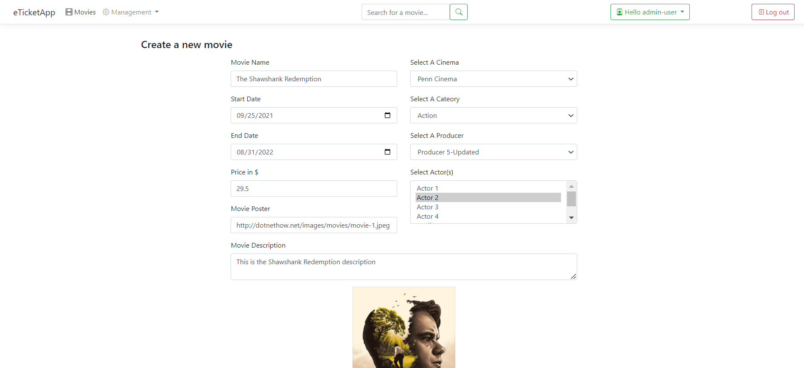

# Full-Stack MVC (eTicketApp) .Net5

 

### MVC 5:
* Topics:
  *	Basic topics
  *	Custom Model Validators (Server/Client)
  *	Custom Action Filters
  *	Using Unobtrusive JS

### Entity Framework Core :
* Topics:
  *	Code First
  *	Fluent API

### Full Stack:
* Topics:
  *	Repository Pattern
  *	SOLID

 

 

## Screenshots:

  

  

  

  

  

  

  

 
